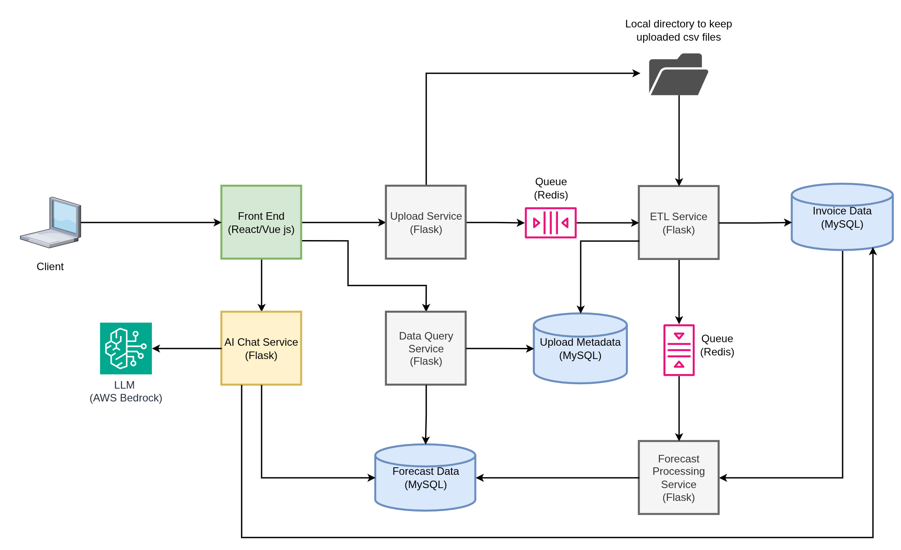

# Time Series Forecasting Platform

A production-ready microservices-based time series forecasting system built with Docker, Flask, Vue.js, MySQL, and Redis. The platform enables intelligent CSV data ingestion with duplicate detection, automated ETL processing with data validation and imputation, and category-wise forecasting using multiple statistical models.

## 📊 Architecture



### System Components

The platform consists of **6 Docker containers** orchestrated via Docker Compose:

1. **Frontend (Vue.js)** - User interface for file uploads and forecast visualization
2. **API Service (Flask)** - REST API for upload and data query operations
3. **ETL Worker (Flask)** - Background worker for data validation, cleaning, and imputation
4. **Forecast Worker (Flask)** - Background worker for category-wise forecasting
5. **Redis** - Message queue for asynchronous job processing
6. **MySQL** - Relational database for metadata, sales data, and forecasts

### Data Flow

1. **Upload** → User uploads CSV via Frontend → API calculates SHA256 hash → Checks for duplicates → Saves file with timestamp → Pushes job to Redis `etl_queue`
2. **ETL** → ETL Worker consumes job → Validates CSV schema → Detects missing values → Performs imputation (forward-fill → 0) → Upserts to `invoice_data` (composite PK handles duplicates/updates) → Pushes job to `forecast_queue`
3. **Forecast** → Forecast Worker consumes job → Aggregates daily sales by category → Trains 3 models (Prophet, SARIMAX, Holt-Winters) → Stores predictions in `forecast_data`
4. **Query** → Frontend requests data via API → Returns upload metadata, invoice data, or forecast results with filtering options

## 🚀 Features

### ✅ Intelligent Duplicate Detection
- **SHA256 file hashing** to identify exact duplicate uploads
- Rejects duplicate files with HTTP 409 and references original batch
- Timestamp-based filename generation prevents file overwrites

### ✅ Smart Data Upsert
- **Composite Primary Key** (date, product_id, category) on invoice_data
- Automatically inserts new records or updates existing ones
- Version tracking increments on each update
- Tracks which batch last modified each record

### ✅ Robust ETL Pipeline
- CSV schema validation (Date, product_id, category, sales)
- Missing value detection and statistical imputation
- Data quality metrics (num_missing_rows, num_imputed_rows, num_inserted_rows, num_updated_rows)
- Error logging with detailed failure messages

### ✅ Category-Wise Forecasting
- Aggregates sales data by category (not product-level)
- Generates forecasts using 3 statistical models:
  - **FB Prophet** - Facebook's time series forecasting tool
  - **SARIMAX** - Seasonal AutoRegressive Integrated Moving Average
  - **Holt-Winters** - Exponential smoothing method
- Configurable forecast horizon (default: 30 days)
- Confidence intervals (lower_bound, upper_bound)

### ✅ RESTful API
- `POST /upload` - Upload CSV file with duplicate detection
- `GET /metadata` - Retrieve upload history and processing status
- `GET /invoice-data` - Query sales data (filter by category, date range)
- `GET /forecast-data` - Query forecasts (filter by category, model type, date range)

## 📁 Project Structure

```
time_series_forecasting/
├── backend/
│   ├── common/
│   │   ├── db.py                    # Database connection and session management
│   │   └── models.py                # SQLAlchemy ORM models
│   ├── upload_service/
│   │   └── app.py                   # Flask API with upload and query endpoints
│   ├── etl_service/
│   │   ├── etl_worker.py            # ETL background worker
│   │   └── etl_worker.sh            # Worker startup script
│   ├── forecast_service/
│   │   ├── forecast_worker.py       # Forecast background worker
│   │   └── forecast_worker.sh       # Worker startup script
│   ├── Dockerfile                   # Backend container image
│   └── requirements.txt             # Python dependencies
├── frontend/
│   ├── src/
│   │   ├── App.vue                  # Main Vue component
│   │   └── main.js                  # Vue app entry point
│   ├── Dockerfile                   # Frontend container image
│   ├── package.json                 # Node.js dependencies
│   └── vite.config.js               # Vite configuration
├── sql/
│   └── init.sql                     # Database schema initialization
├── data/
│   └── uploaded_files/              # Local directory for uploaded CSVs
├── docker-compose.yml               # Multi-container orchestration
├── .env                             # Environment variables
└── README.md                        # Project documentation

```

## 🗄️ Database Schema

### `upload_metadata`
Tracks file upload metadata and processing status.

```sql
CREATE TABLE upload_metadata (
    batch_num VARCHAR(100) PRIMARY KEY,           -- Unique batch identifier
    original_filename VARCHAR(255) NOT NULL,      -- Original uploaded filename
    stored_filename VARCHAR(255) NOT NULL,        -- Timestamped stored filename
    file_hash VARCHAR(64) UNIQUE NOT NULL,        -- SHA256 hash for duplicate detection
    uploaded_at DATETIME DEFAULT CURRENT_TIMESTAMP,
    num_total_rows INT DEFAULT 0,                 -- Total records in CSV
    num_missing_rows INT DEFAULT 0,               -- Records with missing sales values
    num_imputed_rows INT DEFAULT 0,               -- Records where sales was imputed
    num_inserted_rows INT DEFAULT 0,              -- New records inserted
    num_updated_rows INT DEFAULT 0,               -- Existing records updated
    status ENUM('uploaded','processing','completed','failed') DEFAULT 'uploaded',
    error_log TEXT                                -- Error details if processing failed
);
```

### `invoice_data`
Stores cleaned sales data with composite primary key for upsert operations.

```sql
CREATE TABLE invoice_data (
    date DATE NOT NULL,
    product_id VARCHAR(100) NOT NULL,
    category VARCHAR(100) NOT NULL,
    sales DECIMAL(12,2) NOT NULL,
    is_imputed BOOLEAN DEFAULT FALSE,             -- Flag for imputed values
    batch_num VARCHAR(100) NOT NULL,              -- Last batch that modified this record
    file_hash VARCHAR(64) NOT NULL,               -- Hash of file that last modified this
    created_at DATETIME DEFAULT CURRENT_TIMESTAMP,
    updated_at DATETIME DEFAULT CURRENT_TIMESTAMP ON UPDATE CURRENT_TIMESTAMP,
    version INT DEFAULT 1,                        -- Increments on each update
    PRIMARY KEY (date, product_id, category)      -- Composite key prevents duplicates
);
```

### `forecast_data`
Stores category-wise forecasts from multiple models.

```sql
CREATE TABLE forecast_data (
    id INT AUTO_INCREMENT PRIMARY KEY,
    forecast_date DATE NOT NULL,
    category VARCHAR(100) NOT NULL,               -- Category-wise only (no product_id)
    model_type ENUM('prophet','sarimax','holt_winters') NOT NULL,
    forecast_value DECIMAL(12,2) NOT NULL,
    lower_bound DECIMAL(12,2),                    -- Lower confidence interval
    upper_bound DECIMAL(12,2),                    -- Upper confidence interval
    created_at DATETIME DEFAULT CURRENT_TIMESTAMP,
    batch_num VARCHAR(100),
    UNIQUE KEY unique_forecast (forecast_date, category, model_type)
);
```

## 🛠️ Technologies

- **Backend**: Python 3.10, Flask, SQLAlchemy, Pandas
- **Frontend**: Vue.js 3, Vite, Axios, Chart.js
- **Database**: MySQL 8.0
- **Queue**: Redis 7
- **Forecasting**: FB Prophet, Statsmodels (SARIMAX), Scikit-learn
- **Containerization**: Docker, Docker Compose
- **Web Server**: Gunicorn

## 📋 Prerequisites

- Docker Engine 20.10+
- Docker Compose 2.0+
- 4GB+ RAM recommended

## 🚀 Quick Start

### 1. Environment Setup

The `.env` file is already configured with default values:

```env
MYSQL_ROOT_PASSWORD=rootpass
MYSQL_DATABASE=timeseries_db
MYSQL_USER=appuser
MYSQL_PASSWORD=apppass
REDIS_URL=redis://redis:6379/0
UPLOAD_DIR=/app/data/uploaded_files
```

### 2. Build and Start Services

```bash
# Build and start all containers
docker compose up --build -d

# Check service status
docker compose ps

# View logs
docker compose logs -f
```

### 3. Verify Services are Running

```bash
# Check API health
curl http://localhost:5000/health

# Expected response: {"status":"ok"}
```

### 4. Upload a CSV File

**CSV Format Requirements:**
- Headers: `Date`, `product_id`, `category`, `sales`
- Date format: YYYY-MM-DD
- Example:

```csv
Date,product_id,category,sales
2026-01-01,P001,Electronics,1500.50
2026-01-01,P002,Electronics,2300.75
2026-01-01,P003,Furniture,850.00
```

**Upload via cURL:**

```bash
curl -X POST http://localhost:5000/upload \
  -F "file=@/path/to/your/data.csv"

# Response:
# {"message": "file accepted", "batch_num": "data_1737309600_abc123"}
```

**Upload via Python:**

```python
import requests

url = "http://localhost:5000/upload"
files = {"file": open("data.csv", "rb")}
response = requests.post(url, files=files)
print(response.json())
```

### 5. Query Data

**Get Upload Metadata:**
```bash
curl http://localhost:5000/metadata
```

**Get Invoice Data (with filters):**
```bash
# All data
curl http://localhost:5000/invoice-data

# Filter by category
curl "http://localhost:5000/invoice-data?category=Electronics"

# Filter by date range
curl "http://localhost:5000/invoice-data?start_date=2026-01-01&end_date=2026-01-31"
```

**Get Forecast Data:**
```bash
# All forecasts
curl http://localhost:5000/forecast-data

# Filter by category and model
curl "http://localhost:5000/forecast-data?category=Electronics&model_type=prophet"
```

## 📊 API Reference

### Endpoints

| Method | Endpoint | Description | Query Parameters |
|--------|----------|-------------|------------------|
| GET | `/health` | Health check | - |
| POST | `/upload` | Upload CSV file | - |
| GET | `/metadata` | Get upload history | - |
| GET | `/invoice-data` | Get sales data | `category`, `start_date`, `end_date`, `limit` |
| GET | `/forecast-data` | Get forecasts | `category`, `model_type`, `start_date`, `end_date`, `limit` |

### Response Examples

**POST /upload (Success)**
```json
{
  "message": "file accepted",
  "batch_num": "sales_data_1737309600_a3b5c7"
}
```

**POST /upload (Duplicate)**
```json
{
  "error": "duplicate file",
  "batch_num": "sales_data_1737305000_x9y2z1"
}
```

**GET /metadata**
```json
[
  {
    "batch_num": "sales_data_1737309600_a3b5c7",
    "original_filename": "sales_data.csv",
    "stored_filename": "sales_data_1737309600_a3b5c788.csv",
    "file_hash": "a3b5c788...",
    "uploaded_at": "2026-01-19T10:30:00",
    "num_total_rows": 1000,
    "num_missing_rows": 15,
    "num_imputed_rows": 15,
    "num_inserted_rows": 950,
    "num_updated_rows": 50,
    "status": "completed",
    "error_log": null
  }
]
```

## 🛑 Stopping the System

```bash
# Stop all containers
docker compose down

# Stop and remove volumes (WARNING: deletes all data)
docker compose down -v
```
